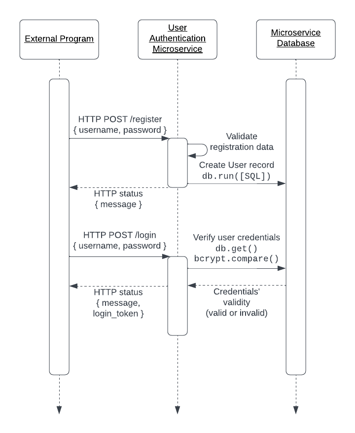

# User Authentication Microservice

---

**Author**: hokevi@oregonstate.edu  
**Project**: CS 361 - Software Engineering I  
**Assignment**: Microservice A

## Overview

This microservice provides a user authentication system to manage user registration and login management.

## Features
*   **User Registration**: Allows users to register with a username and password.
*   **User Login**: Authenticates registered users and issues a JSON Web Token (JWT) for session management.
*    **Password Security**: Hashes passwords using bcrypt for security.
*    **Session Authentication**: Uses JWT to validate user sessions for secure access to protected routes.

## Technologies Used
- **Node.js**: Server-side runtime.
- **Express**: Web framework for routing and handling HTTP requests.
- **SQLite**: Lightweight database for local data storage.
- **JWT**: Used for authentication and session management.
- **bcrypt**: Used to hash passwords securely.

## Getting Started
1.  Ensure that Node.js is installed.
2.  In your terminal, navigate to the `\login-microservice\backend\` directory.
3.  Run `npm install` to ensure that required packages are installed.
4.  Start the microservice locally using `node server.js`, and the program will run on the designated PORT (default: port 5000).
5.  In your main program, incoporate the appropriate API calls to send/receive messages from the microservice (see [Using the Microservice](#using-the-microservice)).

## Using the Microservice
The User Authentication Microservice can be interaced with the following endpoints:

| Endpoint    | Method | Description           |
| ----------- | ------ | --------------------- |
| `/register` |  POST  | Registers a new user. |
| `/login`    |  POST  | Authenticate a user.  |

### How to Request and Receive data
This microservice communicates via HTTP requests with [JSON](https://en.wikipedia.org/wiki/JSON) serialized messages.

#### Requesting Data
Data can be requested from the microservice by using the `POST` HTTP request type, with the relevant endpoint route to send the input JSON object to elicit a response.

Example call:
```JavaScript
// Note: only the call-related example code is included here (excludes HTML form inputs and other JavaScript).

const API_URL = 'http://localhost:5000';

// Add code here to read form input values using event listener for async function.
const requestBody = { username, password };

// Handler for registration.
const response = await fetch(`${API_URL}/register`, {
    method: 'POST',
    headers: { 'Content-Type': 'application/json' },
    body: JSON.stringify(requestBody)
});

// Different handler for login.
const response = await fetch(`${API_URL}/login`, {
    method: 'POST',
    headers: { 'Content-Type': 'application/json' },
    body: JSON.stringify(requestBody)
});

```

#### Receiving Data
Response data is sent from the microservice as an HTTP status message and JSON object. The caller program can read the response message and deserialize the response JSON object for downstream processing based on the data received.

Example call: 
```JavaScript
// Add code here to send response.
const responseBody = await response.json();
if (response.ok) {
    // Do something (with the response message).
} 
// Add other code here.
```

### Request and Response Format Reference
#### POST /register
##### Request Body
```json
{
  "username": "example_user",
  "password": "example_password"
}
```

##### Request Response - Success (201):
```json
{
  "message": "User registered successfully"
}
```


##### Request Response - Client Error (400):
```json
{
  "message": "Error creating user"
}
```

##### Request Response - Server Error (500):
```json
{
  "message": "Error creating user"
}
{
  "message": "Error hashing password"
}
```

#### POST /login
##### Request Body
```json
{
  "username": "example_user",
  "password": "example_password"
}
```

##### Request Response - Success (201):
```json
{
  "message": "Login successful",
  "token": "eyJhbGciOiJIUzI1NiIsInR5cCI6IkpXVCJ9..."
}
```

##### Request Response - Client Error (400)
```json
{
  "message": "Username and password are required"
}
```

##### Request Response - Client Error (401)
```json
{
  "message": "Invalid credentials"
}
```


##### Request Response - Not Found (404)
```json
{
  "message": "User not found"
}
```

##### Request Response - Server Error (500)
```json
{
  "message": "Error comparing passwords"
}
```

## UML Sequence Diagram



## Contact Me 
For any issues, please send me a message at hokevi@oregonstate.edu or file a bug here.